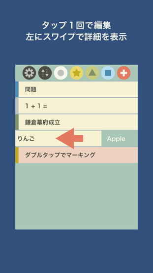

# ひかりノート

## ひかりノートとは?

簡単操作のノートです。  
簡易な色分けもできます。  
音声読み上げ機能付き。  
単語の検索機能も実装。  
工夫次第で色々な使い方ができると思います。  
例えば暗記カードやToDoリストなどに。

使い方は 赤い+ボタンを押してノートを作ります。  
ノートをタップで編集へ。  
編集画面ではメインノートとサブノートへ文字の入力と  
タグを利用した色分け・削除・検索。

ノートをダブルタップでマーキング。  
チラ見機能としてノートを右から左へスワイプすることで  
サブノートの中身の一部をチェックできます。  
設定ボタンから色ごとの削除も可能です。  
おまけで外部からのテキスト追加機能があります。  
ファイルAPPのadd.csvに記入した文字が起動時に登録。  
登録したデータが破損しても保証はありません。

 JP
